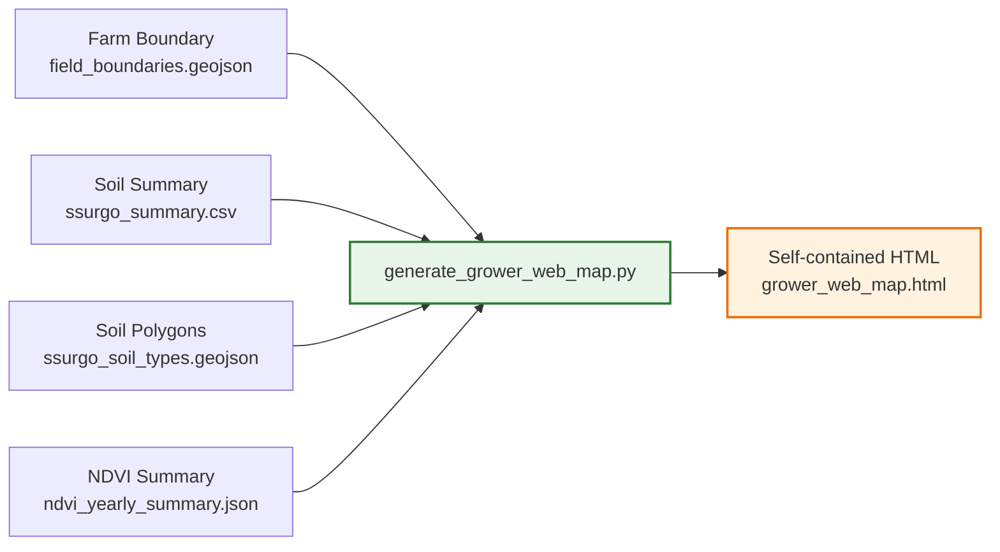
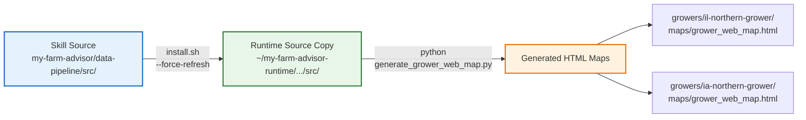

# Grower Web Map — Verification & Test Results

## Test Environment

| Property | Value |
|----------|-------|
| Branch | `FP1` |
| Runtime root | `~/my-farm-advisor-runtime` |
| Growers tested | `il-northern-grower` (Illinois), `ia-northern-grower` (Iowa) |
| Script | `src/scripts/reporting/generate_grower_web_map.py` |
| Date | 2026-07-17 |

## Commands Executed

### 1. Sync runtime source

```bash
cd my-farm-advisor/data-pipeline
./scripts/install.sh --force-refresh --no-install-deps
```

### 2. Generate Illinois grower map

```bash
export DATA_PIPELINE_DATA_ROOT=$HOME/my-farm-advisor-runtime
"${DATA_PIPELINE_DATA_ROOT}/data-pipeline/.venv/bin/python" \
  "${DATA_PIPELINE_DATA_ROOT}/data-pipeline/src/scripts/reporting/generate_grower_web_map.py" \
  --grower-slug il-northern-grower
```

### 3. Generate Iowa grower map

```bash
export DATA_PIPELINE_DATA_ROOT=$HOME/my-farm-advisor-runtime
"${DATA_PIPELINE_DATA_ROOT}/data-pipeline/.venv/bin/python" \
  "${DATA_PIPELINE_DATA_ROOT}/data-pipeline/src/scripts/reporting/generate_grower_web_map.py" \
  --grower-slug ia-northern-grower
```

## Output Verification

| Grower | Output Path | File Size | Status |
|--------|-------------|-----------|--------|
| `il-northern-grower` | `growers/il-northern-grower/maps/grower_web_map.html` | **26.2 KB** | ✅ Generated |
| `ia-northern-grower` | `growers/ia-northern-grower/maps/grower_web_map.html` | **232.3 KB** | ✅ Generated |

> **Note:** The Iowa map is larger because its fields are significantly larger (155, 271, and 16 acres) compared to Illinois (2.2, 3.9, and 0.8 acres), resulting in more coordinate vertices in the GeoJSON.

## Requirements Checklist

| Requirement | Implementation | Status |
|-------------|----------------|--------|
| Use actual downloaded field polygon boundaries | Reads `boundary/field_boundaries.geojson` per farm | ✅ |
| Show field polygons on a generic basemap | Esri Satellite + OpenStreetMap via CDN | ✅ |
| Show all fields for each grower | Iterates all farms and fields under `growers/<slug>/farms/` | ✅ |
| User can zoom in and out | Leaflet.js default zoom and pan controls enabled | ✅ |
| Click a field to see basic metadata | Popup shows: Grower, Farm, Field name, ID, Area (acres), County, soil data | ✅ |
| Simple field list / control to zoom to fields | Sidebar field list; click zooms to field and opens popup | ✅ |
| HTML output reasonably small | GeoJSON + summary values only; no rasters or imagery embedded | ✅ |

## Data Flow

The following diagram illustrates how pipeline output assets are consumed to produce the self-contained HTML map:



## Runtime Architecture

The following diagram shows the relationship between the skill source, the runtime copy, and the generated output:



## Observations

- Both growers have **empty NDVI yearly summaries** (`"years": []`), so the NDVI layer correctly shows “no data” and is disabled in the UI.
- SSURGO soil summaries are present for both growers, so **Soil OM%**, **Soil pH**, and **Soil Polygons** layers are functional.
- The generated HTML files are pure static assets with no server dependency; they can be opened directly in any modern browser.
- Per the repository asset policy, generated HTML maps live under the runtime directory and are **not committed to Git**.
